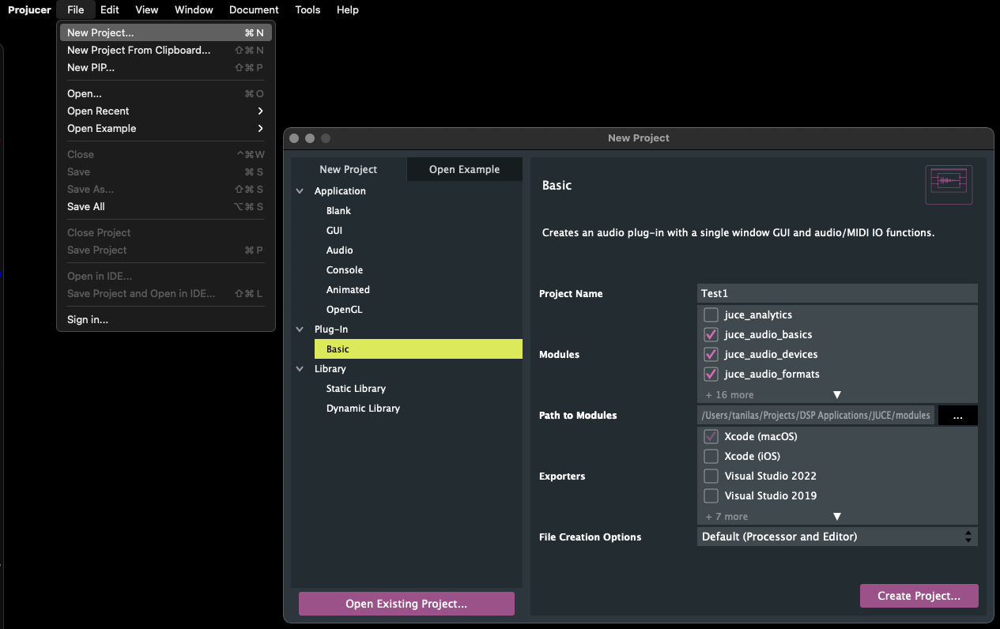
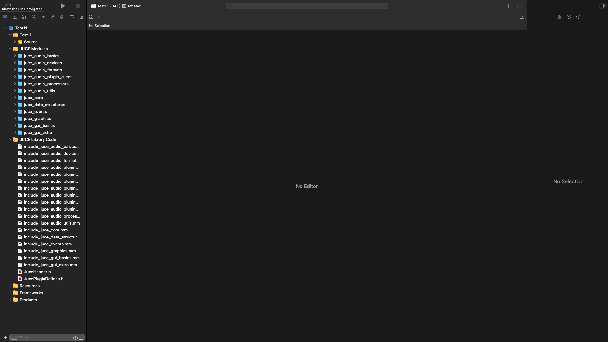
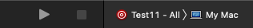
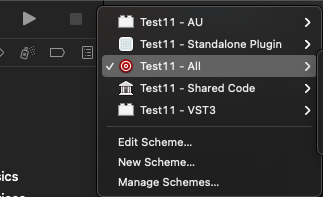
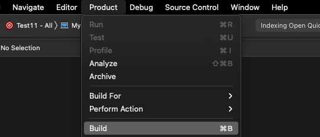
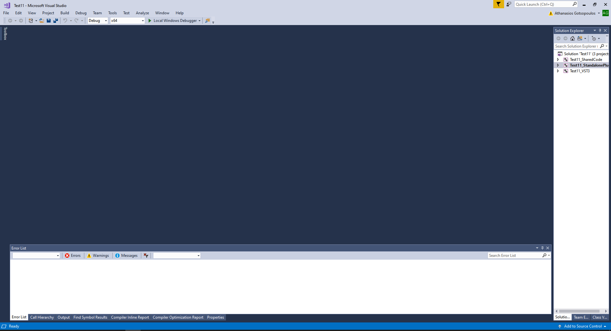
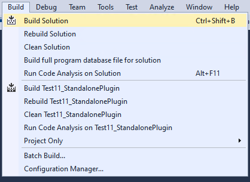

 These instructions will get you started to compile your first “Hello World plugin”. 

## Getting JUCE

​If you haven’t download JUCE, do so from here:

[https://juce.com/get-juce/download](https://juce.com/get-juce/download)

Then extract the downloaded file in a location of your preference (remember the location), then run Projucer.

## Create a new project

When you run Projucer go to *File \-\> New Project…*  
and from there choose from the *Plug-In* category *Basic*.

On the Project Name field on the right, put any name you like. 

The process is identical both on Windows and OSX. Only difference is the location of the File Menu.

Then click *Create Project*. Then you will be asked to choose the location that the project will be created. The Project will create a directory of its own, so if your project is called **Test1**, a folder called *Test1* will be created in the location you chose that will contain all the project related files.

Now your project should be open, looking something like this:

Now the project is ready to build

## Opening the project on the IDE

Depending on the operating system that you are using (Windows or OSX), the top of the project will be showing the corresponding *IDE* to use with your project

For macOS it will look like this  

For Windows it will look like this (but most probably with a newer Visual Studio version instead of 2017\)

Click on the icon to open the corresponding *IDE*

Explanation: IDE stands for Integrated Development Environment and it is just a “program” that handles everything for building projects such as file editing, compiling, debugging etc. Visual Studio and XCode are IDEs. Similarly PyCharm is an IDE for Python

Here, things differ between Mac and Windows as different IDEs open.

## Compiling on Mac

On Mac (XCode) it will look like this:

On the top make sure that you have selected the configuration that builds *All* products. This selection will allow generating the VST plugin, the Standalone application and anything else that was chosen in the settings.

To build the project click on *Product* and then *Build*

This takes some time. If everything succeeds, the generated plugins and applications will be located at

*\<LocationOfProject\>/Builds/MacOSX/build/Debug/*

For example if the project is called *Test3* then the VST3 plugin will be in 

*Test3/Builds/MacOSX/build/Debug/Test3.vst3*

## Compiling on Mac

On Windows, opening Visual Studio will look like this:  

To build the project (so called solution) Go to *Build* menu and click *Build Solution*

This will take some time. If everything succeeds the results will be located in 

*Test11\\Builds\\VisualStudio2017\\x64\\Debug* 

(if the name of the project is *Test11* and you use *VisualStudio2017*)

Ready to use the “Hello World” plugin on Reaper\!

Check the rest of tutorials on how to load the plugin on Reaper.