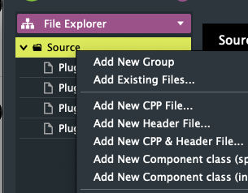
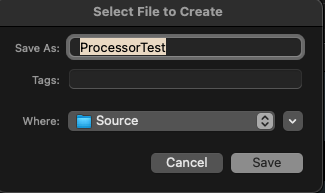
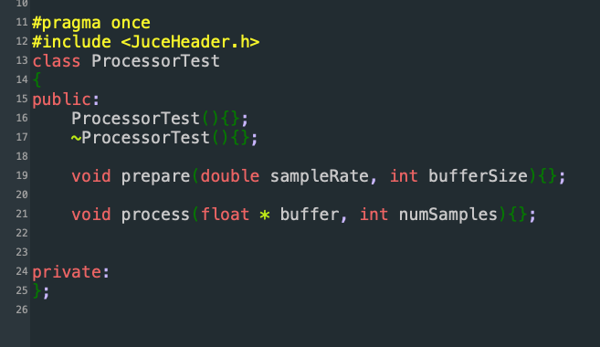
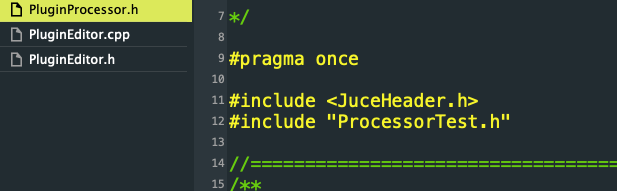
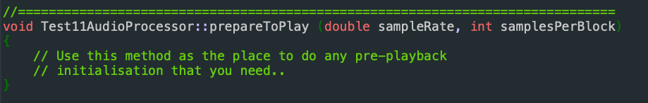
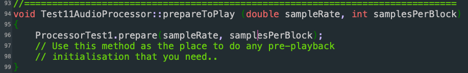
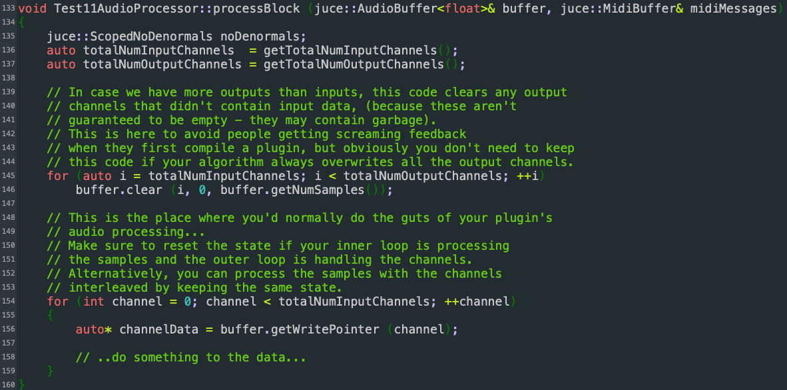
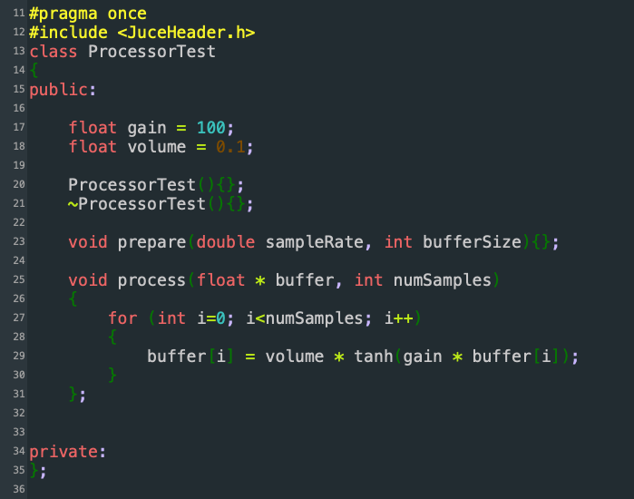

Make a new plugin project as described in the other tutorial.

Let’s say that you call it `Test1`.

### Add new files to code your new class

Now make sure that you have expanded the `Source` section in Projucer and right click on `Source` and choose `Add New CPP & Header File…`



This will prompt you to give a name to the new pair of files. Give it the same name as the class that we will make. For example `ProcessorTest1`



Now go to `ProcessorTest.h` file and code the new class the will be used by the plugin



The code is also here

```
#pragma once  
#include <JuceHeader.h>  
class ProcessorTest  
{  
public:  
    ProcessorTest(){};  
    ~ProcessorTest(){};  
      
    void prepare(double sampleRate, int bufferSize){};  
      
    void process(float * buffer, int numSamples){};  
      
      
private:  
};
```

This has now the basis to process sound and actually does nothing.   
Let’s go put in the project first and then we will fill it with DSP code.

### Add your processor to the PluginProcessor

Go edit first the file `PluginProcessor.h` to add a new object based on the class you made above

First we need to load the newly made header file, by adding the line

```#include "ProcessorTest.h"```



This will include the code for the new class.

Now we go and make a new object based on the new class:

```ProcessorTest ProcessorTest1;```


Now we need to go and edit the `PluginProcessor.cpp` file to use the object we created. We want to “prepare” our processor when the plugin function `prepareToPlay` is called and process audio when the plugin is processing audio

Go and find the function `prepareToPlay` starting around line 93  



now we prepare our object by adding the line

```ProcessorTest1.prepare(sampleRate, samplesPerBlock);```

Now the function looks like this



Now we go edit the processBlock function starting around line 133 which looks like this:



We need to add and change a few things in order to process audio with our new processor. We will be processing only channel 0 (left channel) and we will be copying the result to the right channel. So we will make a stereo out of mono.

First we need to store the size of the buffer into an integer. We will add this:

```int numSamples = buffer.getNumSamples();```

Then we need to make sure we edit only the first channel, so we will edit the for-loop that repeats for each channel. From this:  

```for (int channel = 0; channel < totalNumInputChannels; ++channel)```

it will become like this

```for (int channel = 0; channel < 1; ++channel)```

(replacing `totalNumInputChannels` with `1`

Then, within the for-loop we have to process the audio with our processor. We will add

```ProcessorTest1.process(channelData, numSamples);```

Last thing to do is to copy the processed audio also to the other (right) channel. We do that outside the for-loop by adding the line:

```
memcpy(buffer.getWritePointer(1),buffer.getWritePointer(0),numSamples*sizeof(float));
```

This essentially copies all the buffer data from the left channel to the right one.

When all the changes are added the function should be looking something like this:

![][image9]  
Now the project should compile fine and run fine. Let’s now code the distortion in our processor.

### Making the distortion processors

Now we go back to our processor’s header (e.g. `ProcessorTest.h`)

First we add two new `public` variables, one for the gain and one for the volume. We add:

```
float gain = 100;
float volume = 0.1;
```

Our processor now looks like this:


Then we need to edit the process function so that it distorts the sound using a hyperbolic tangent function ( **tanh()** in C++)  
First we add a for-loop in order to process each separate sample:

```
for (int i=0; i<numSamples; i++)
{
}
```

This for-loop will repeat until i has taken all the values from 0 until `numSamples-1`.

Then inside the for loop we replace each sample with a distorted version of itself by writing:

```
buffer[i] = volume * tanh(gain * buffer[i]);
```

This makes the processors as a whole look like this:



Now the plugin is ready to be compiled and used to distort audio
