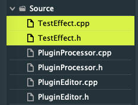
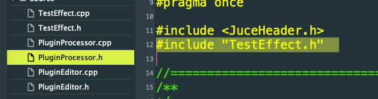
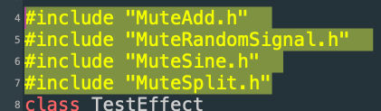
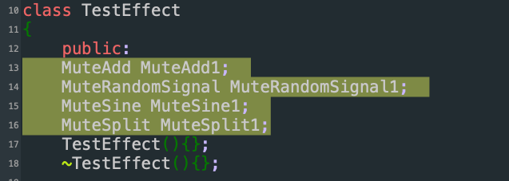
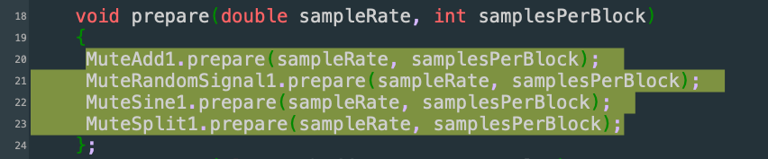
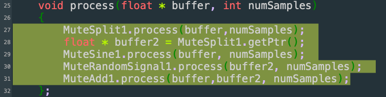

In this tutorial we go through the process of making a new project with an effect class where we will start adding processors that will be doing whatever we need for our plugin.

Make a new project by following the instructions in the tutorial [​”Setting up a new JUCE project”](./Tutorial%201%20-%20Setting%20up%20a%20new%20JUCE%20project.md). In this example I made a project called `TestEffect`.

Once your project is ready you are ready to make a new class that will be handling all the processors of your effect. 

Right click on the Source folder and select “Add New CPP & Header File…”  


Then you will be prompted to choose a name for the new class. I use TestEffect as a name for this new class, which is the same name as the Project. IT DOESN’T HAVE TO BE THE SAME.

Then the .h and .cpp files will be created and appear in the project:  


Then we need to set up the new class before we can use it for processing in the `PluginProcessor`. We will edit the TestEffect.h so that it looks like this:

---
```
#pragma once  
#include <JuceHeader.h\>

class TestEffect  
{  
    public:  
    TestEffect(){};  
    ~TestEffect(){};  
      
    void prepare(double sampleRate, int samplesPerBlock)  
    {  
    };  
    void process(float * buffer, int numSamples)  
    {  
    };  
    private:  
      
}; 
``` 
---

Keep in mind that the name of the constructor and the destructor should be the same as the class. But if you have chosen a different name, you have to adjust them accordingly

### Adding the processor functionality in the plugin

Now it’s time to add the effect to our plugin, although the plugin does nothing yet.  
Let’s add it to the plugin and in the next section we will start doing some processing.

First we need to include the header



 and then add a new object of this class in the `PluginProcessor` header (.h):


Now we switch to the PluginProcessor.cpp and prepare the effect in the prepareToPlay function so that the function looks like this:

```
void TestEffectAudioProcessor::prepareToPlay (double sampleRate, int samplesPerBlock)  
{  
    TestEffect1.prepare(sampleRate, samplesPerBlock);  
    // Use this method as the place to do any pre-playback  
    // initialisation that you need..  
}
```
then process the plugin in the processBlock function, so that the function looks like this:
```
void TestEffectAudioProcessor::processBlock (juce::AudioBuffer<float>& buffer, juce::MidiBuffer& midiMessages)  
{  
    juce::ScopedNoDenormals noDenormals;  
    auto totalNumInputChannels  = getTotalNumInputChannels();  
    auto totalNumOutputChannels = getTotalNumOutputChannels();

    for (auto i = totalNumInputChannels; i < totalNumOutputChannels; ++i)  
        buffer.clear (i, 0, buffer.getNumSamples());

    int numSamples = buffer.getNumSamples(); // THIS  
      
    for (int channel = 0; channel < 1; ++channel) // CHANGED TO 1!  
    {  
        auto* channelData = buffer.getWritePointer (channel);

        TestEffect1.process(channelData, numSamples); // THIS  
    }  
      
    //ADDED THE FOLLOWING ONE  
    memcpy(buffer.getWritePointer (1), buffer.getWritePointer (0), numSamples*sizeof(float));  
}
```
---

### Adding processor to the effect

Now if our plugin builds fine (as it should) we will start adding some processors. We will make a plugin that generates white noise and a sine wave and adds these two signals.

Download the `MuteAdd, MuteSplit, MuteSine, MuteRandomSignal processors` from [the processors](../Processors/), copy them to the Source folder of your plugin and add them to the project. Then the project will look like this:

\!\!\! MuteAdd is now called MuteMix to avoid confusion with the processor that adds a constant number. Use MuteMix instead wherever you see MuteAdd.


### Adding the processors to your effect

Now you need to add objects to your effect. The following changes are only in the header (`.h` file) of your effect (`TestEffect.h` in this example). You don’t need to change anything anymore in any other file.

First you need to include the processors you will use:  


Then you need to declare one object per processors



In the prepare function you will prepare all of your objects:



Then on the process function you decide what you will do with the processing. In this example you will first make a copy of the buffer using the MuteSplit1. This will make a copy buffer called buffer2. Then you  generate a sine wave that replaces overwrites on the original buffer (buffer), while the `MuteRandomSignal1` object overwrites the copied buffer (`buffer2`) with white noise.  

