In this tutorial, you will go through making a distortion plugin with a slider to control the amount of gain.

First, make a new project by following the tutorial “​[​Setting up a new JUCE project](./Tutorial%201%20-%20Setting%20up%20a%20new%20JUCE%20project.md)​”. You can call it whatever you like but for this tutorial we will call it Test1.

Now go to the “Processors” shared directory [here](../Processors/) and download `MUTE_Distortion.h` and `MUTE_Distortion.cpp` files. Copy them to the `Source` directory of your project. Any easy way to access the Source directory is by right-clicking to one of the files in your project and selecting `Reveal in Finder` for MacOS, or `Reveal in Explorer` for Windows like shown below

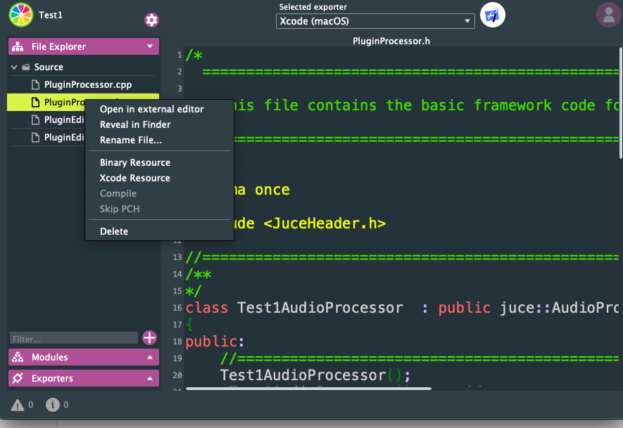

Then add both of the files of the processor (.h and .cpp) to your project by right clicking to the Source folder and then `Add Existing Files…`:


Then browse to the Source Folder, select the files (`MUTE_Distortion.h` and `MUTE_Distortion.cpp`) and press `Open:`  
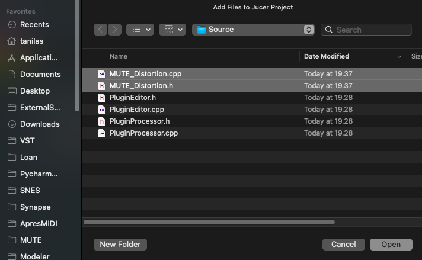

This will add the files to your Project which you can now see in the left side in the Source directory:  
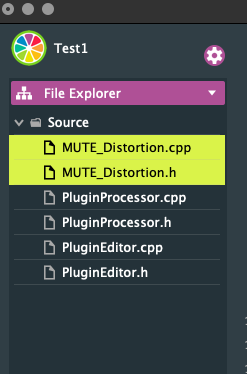

Now you are ready to use the processor you downloaded and added to your project. Let now add it to the project.

### Processing sound with the added processors

In this section we add the processor (`MUTE_Distortion`) in the plugin to process sound. This is identical to the section “Add your processor to the PluginProcessor” from the tutorial “[How to make a distortion plugin](./Tutorial%202%20-%20How%20to%20make%20a%20distortion%20plugin.md)”.

In the `PluginProcessor.h` we include the processor’s header   
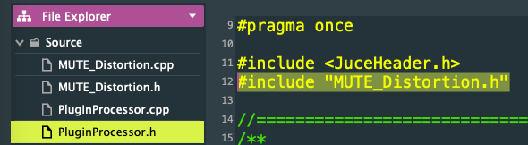

and then declare a new object of the `MUTE_Distortion` that we name `MUTE_Distortion1`  
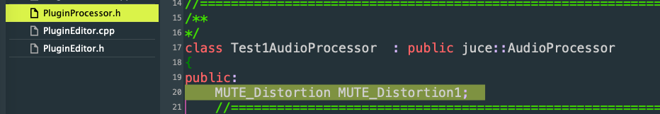

Then we go to `PluginProcessor.cpp` and call the prepare function of our `MUTE_Distortion1` object inside the `prepareToPlay` function

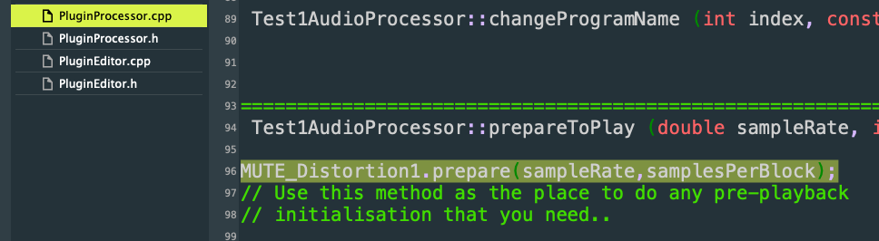

Then we change the processBlock function to use the `MUTE_Distortion1` object to process audio:

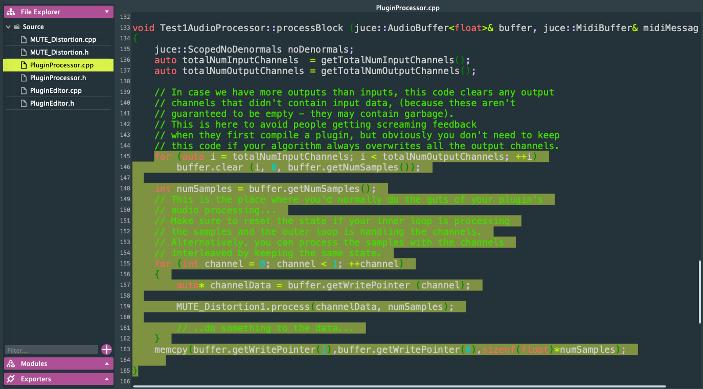

Now the plugin should build and run fine, but it doesn’t have yet any controls.

### Adding the controls

To add a control (Slider) in the UI we need to change the `PluginEditor`. The process consists of the following steps:

1. Declare a new Slider object (in `PluginEditor.h`)  
2. Allow the Slider to be visible (in `PluginEditor.cpp`)  
3. Set the range of the new slider, that is, the minimum value, maximum value and the minimum value that the Slider allows (in `PluginEditor.cpp`)  
4. Set the initial value of the Slider  (in `PluginEditor.cpp`)  
5. Set the location for the new Slider (in `PluginEditor.cpp`)  
6. Set the function that the Slider will call when it is moved (in `PluginEditor.cpp`)  
   

First declare your new slider that we will name `gainSlider`

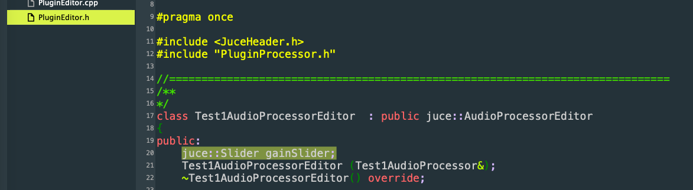

This declares an object called `gainSlider` from the class `Slider` of the namespace `juce`, hence the `juce::Slider`

Now we switch over to `PluginEditor.cpp` and add the functionality for the slider. It will look like this:

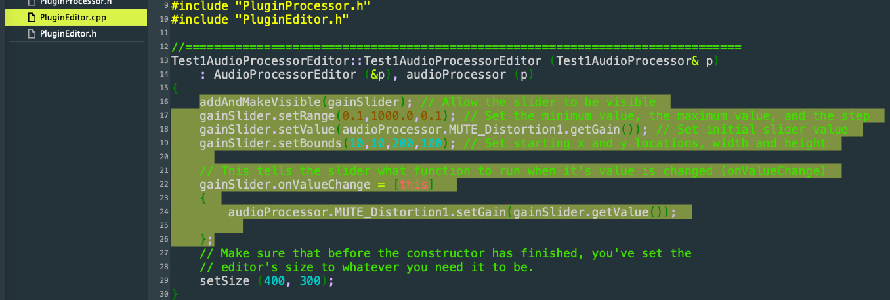

Now the plugin should compile and look like this:  
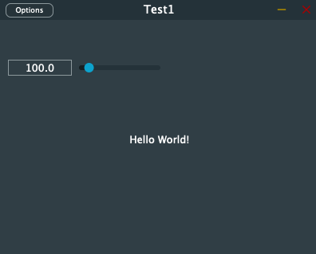

The plugin is ready! But let’s analyze in more detail what we did in the PluginEditor.cpp. 

The following line simply allows the slider to be visible. It won’t be visible though before we set a location for it.

```addAndMakeVisible(gainSlider);```

The following line sets 0.1 as the minimum value of the slider and 1000 as the maximum value of the slider. Then the third argument (0.1) tells how big steps can the slider do each time (e.g. from 0.1 to 0.2)

```gainSlider.setRange(0.1,1000.0,0.1);```

The following line sets an value to the slider. It actually sets the value that the processor has for that value by calling the `getGain()` function of the `MUTE_Distortion1` object from the `audioProcessor` object. Remember that the `PluginEditor` HAS access to the `PluginProcessor`, but the audio processor DOES NOT HAVE access to the `PluginEditor`.

```gainSlider.setValue(audioProcessor.MUTE_Distortion1.getGain());```

The following line sets the location and the size of the slider. The first argument sets the starting x location (10), the 2nd argument sets the starting y location (10), the 3rd sets the width (200) and the 4th the height (100). These might look a bit abstract, but keep in mind that these numbers should be within the limits of the window that is set by the setSize function

```gainSlider.setBounds(10,10,200,100);```

The setSize function is found in the end of the constructor of the PluginEditor:

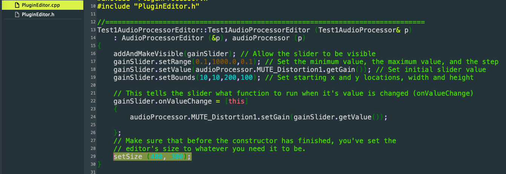

Also keep in mind that when you set the limits starting at location x 10 and with width 200 it will reach until 210. Make sure you don’t get out of the window limits that you have set by the `setSize`.

The following bunch of code looks a bit complicated. In brief you tell the slider what to do when you move the slider (`onValueChange`). In this code, you tell it to set the gain of the `MUTE_Distortion1` object equal to the value of the slider

```
gainSlider.onValueChange = [this]
{  
    audioProcessor.MUTE_Distortion1.setGain(gainSlider.getValue());
};
```

---

### Changing the Slider style

By default, when you add a slider it will be a horizontal slider.


 JUCE has different kinds of sliders and you can set the slider style accordingly. To change for example the slider style to a rotary one you will need to add an extra line in the PluginEditor.cpp and make it look like this:  
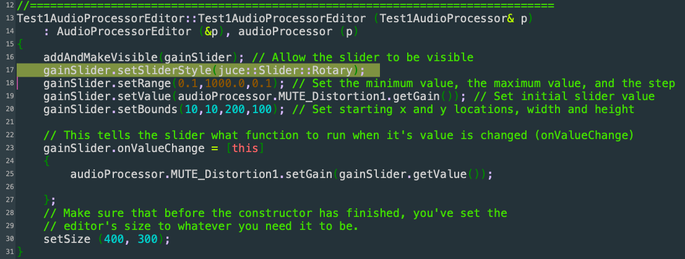

This will make the slider look like this:  


You can also see other slider styles in JUCE documentation [here](https://docs.juce.com/master/classSlider.html#af1caee82552143dd9ff0fc9f0cdc0888). There you see that there is also a style for vertical sliders:

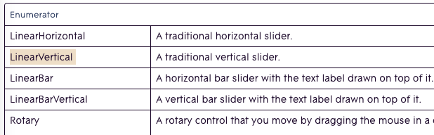

If you want to use a vertical slider then you have to change the line on your code above to:

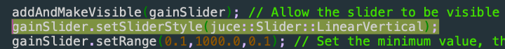

You might wonder “Why again the whole `juce::Slider:LinearVertical` thing ?”. In brief this means that from the `juce` namespace from the `Slider` class we select the `LinearVertical` option.  
Feel free to experiment with other options as well.

### Removing the “Hello World” text

You might want to remove the `"Hello World!"` text at this point. In the `PluginEditor.cpp` you will find the `g.drawFittedText` function:

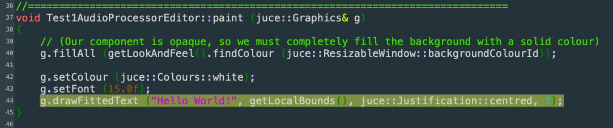

You can either change the text to whatever you like or feel free to delete that line or comment it out:

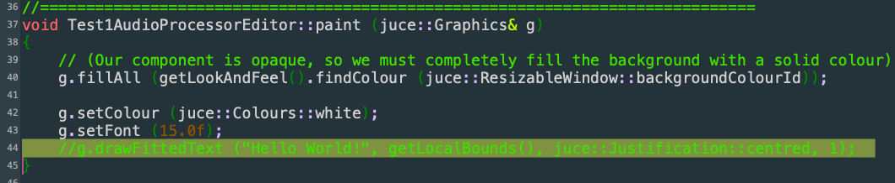

If you want to add custom text, for example under your sliders, you can replace the

```g.drawFittedText ("Hello World!", getLocalBounds(), juce::Justification::centred, 1);```

with

```g.drawText("Gain",200,200,100,50,juce::Justification::left,false);```

This will add the text gain in starting x position 200, starting y position 200, width of 100 and height of 50. Don’t bother about the  `juce::Justification::left` and the `false` extra arguments for now. 

Try adjusting the location of the text so that is under or next to the slider.