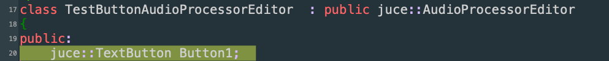
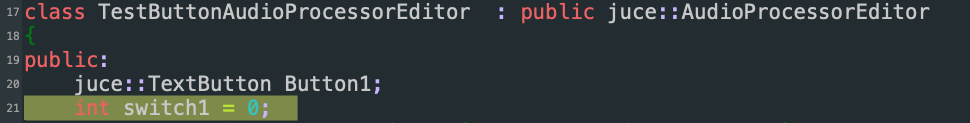
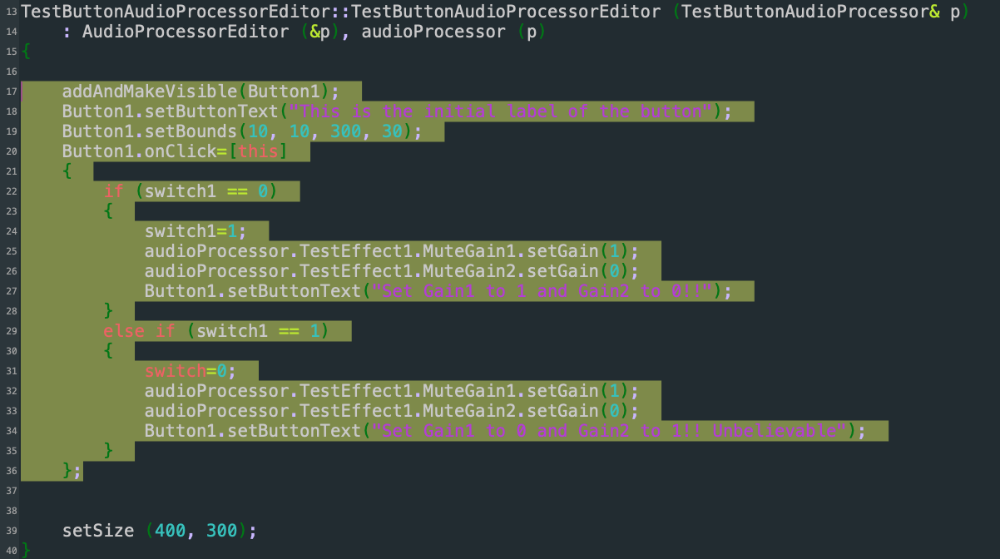

In this tutorial we go through the process of adding a button in the plugin. This button will be switching a variable on and off (1 and 0\) and will be changing the label of the button accordingly. This example can be used to trigger different behaviors in the plugin, for example setting different parameters to your effect.

As an example, we make a button that sets the gain of a MuteGain object `MuteGain1` to 1 while setting the gain of another MuteGain object `MuteGain2` to 0. When pressing the switch it sets the gains to 0 and 1 respectively. Such an example can be used to switch between two processing paths.  
Check other tutorials to get started on how to make a new empty plugin. You can follow this tutorial either in a freshly made plugin or in your existing plugin.

In PluginEditor.h declare a new JUCE TextButton object:  

then also make a new `int` variable that will be used for switching between the two states (here called `switch1`)

Then in the constructor of PluginEditor.cpp we need to make it visible, set its label, define its position and define its function when we press on it.  
Now we set an initial label "This is the initial label of the button", and when we press it the function onClick is called.   
Inside this function we use if statements to check the status of switch1: if the switch1 is 0 then we change it to 1 and if it is 1 we change it to 0\. In both cases it updates the gains of MuteGain1 and MuteGain2, the switch value and the button label:

This can be used for various other purposes, for example switching between different modes, or different oscillators. Your code is responsible for keeping track of what state the plugin is set at and then show the corresponding label.