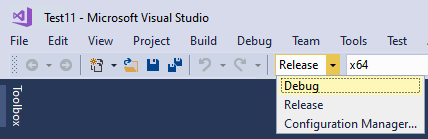
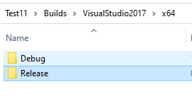
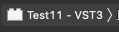
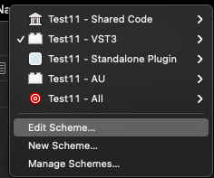
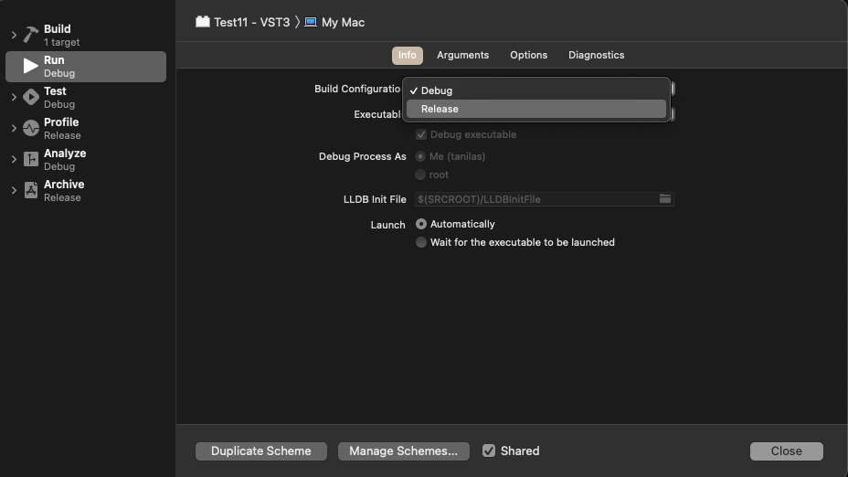
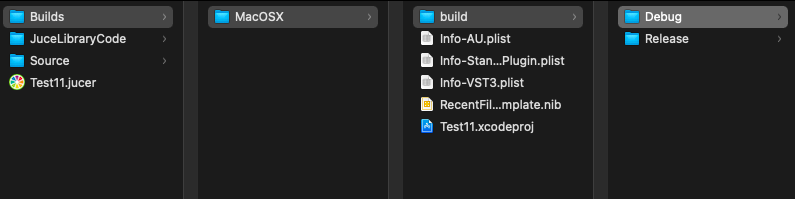
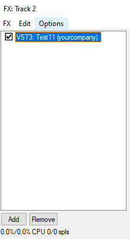

Typically, when you build a plugin (or a program in general), there are many different settings on the building process related to optimization and for allowing the user to `Debug` the program. `Debugging`, means that it allows the developer to run the plugin step-by-step in order to detect problems that may occur and solve them (hence called `Debugging`).

In contrast, the `Release` version is a build optimized for performance. So it runs faster, consuming less CPU and less memory but it doesn’t allow the developer to run parts of the code step-by-step.

Building the `Release` version is significantly slower than building the `Debug` version. Also each build makes a different folder.

### Visual Studio (Windows)

In `Visual Studio` it is straightforward to switch between `Debug` and `Release`. You can do that simply by choosing from the menu on top

(In this example the project is called Test11 but it does not matter at all.)

Each of these configurations builds a different folder under the project directory:  

If you build both, there will be a built plugin in both folders, then it is a matter of choosing which one you want to use.

### 

### XCode (MacOS)

When you have opened XCode, you have to click on your selected configuration:

and then from the drop-down menu select “Edit Scheme..”

In the window that appears, you can choose in the Build Configuration Menu “Debug” or “Release”

The results of each configuration are again stored in different directories for `Release` and `Debug`:  

Keep in mind that since XCode is copying automatically the VST3 to the proper location (e.g.  
/Users/tanilas/Library/Audio/Plug-Ins/VST3),the latest build will overwrite the previous plugin.

### Measuring the CPU performance of the plugin

On Reaper you can get a rough report on the CPU load of your plugin on the FX section where you load the plugins. Check the percentages at the bottom. In this (bad) example the plugin is just a Hello World so it is very very light to show any CPU percentage. But for heavier plugins, you should see clear difference between `Release` and `Debug` versions  
