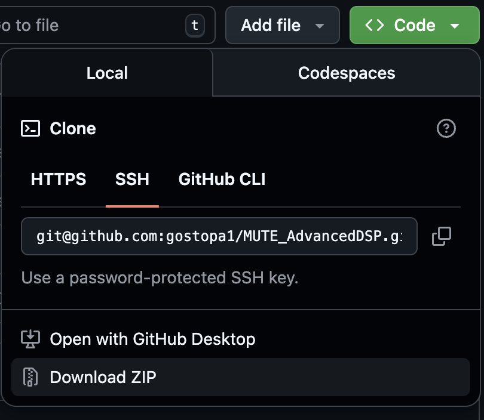
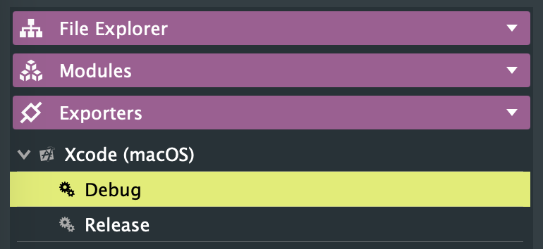
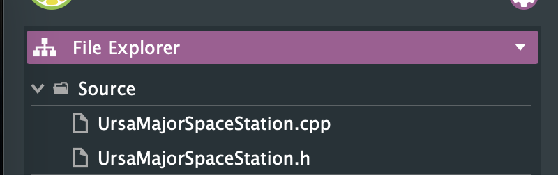

When using processors in a project you have to `include` them in your code, you do for example:  
```#include "example.h"```

Previously, we had been copying the processors to our project's `Source` directory. You can instead, make the project to point to the directory that includes all the processors by adjusting the `Header Search Paths`. Then you can avoid further copy-pasting and use directly the processors where you have written them or downloaded them. That's what this tutorial covers.

### Download (or clone) this repository

You can find the repository [here](https://github.com/gostopa1/MUTE_AdvancedDSP/) and either download it manually through the `Download ZIP` button:



and unzipping the ZIP file,

or by cloning it using the command line:

```
git clone git@github.com:gostopa1/MUTE_AdvancedDSP.git
```

Then find the location it was cloned or downloaded, for example in my computer it is in:
```
/Users/tan/Documents/MUTE/MUTE_AdvancedDSP/
```
We will need this directory location to put it in JUCE, so that JUCE knows where to look for the libraries.

### Add the header search paths in JUCE

In your project in JUCE you can directly add more directories that your project will be looking for header files (i.e. `.h` files).

In your project, in your `Exporter` settings, choose Debug or Release as shown in the left:



Then on the right side you will see a field named `Header Search Paths`. You will need to add the directory where you have your processors there:


As you see, we need to add both subdirectories (Processors and Examples) to be able to import header files from each of them.

Now you can directly use the processors from the location you downloaded them, without copypasting files. 

#### Warning

Keep in mind that now the files will not be showing to your project but they will be included. But if you want to do changes, they don't appear in ProJucer, nor in XCode or Visual Studio. 

If you want them to appear, you can just drag & drop the files you need to your project on the `File Explorer` view (no need to copy the files themselves). For example:



### A bit of git... if you used git

If you used git through the terminal or any other way, you can always get the latest files by going to your directory, e.g.

```cd /Users/tan/Documents/MUTE/MUTE_AdvancedDSP/```

and through the terminal "pull" the latest changes:  

```git pull```

If you have made changes and you want to revert to the original files (and lose or your local changes!) do:

``` git reset ```
